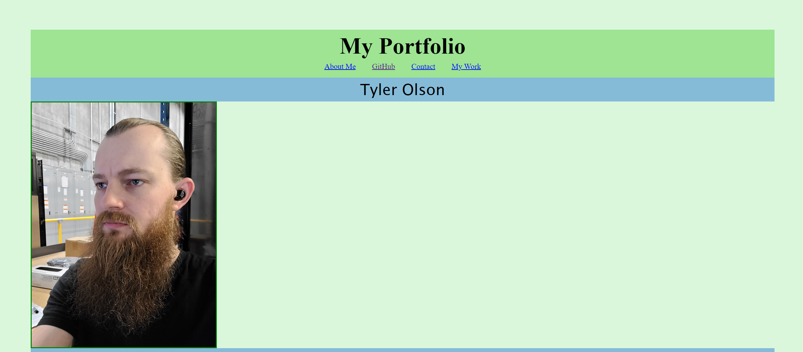

# My Portfolio Webpage

## Description

The purpose of this homework assignment was to create a webpage that is a portfolio for some of our work that we could submit to potential employers. The webpage was created completely on my own and has a responsive display and layout.

https://theinterloper.github.io/02-advanced-css-portfolio/

## Installation

N/A

## Usage

A webpage that uses advanced CSS such as flexbox

## Credits

N/A

## License

N/A
